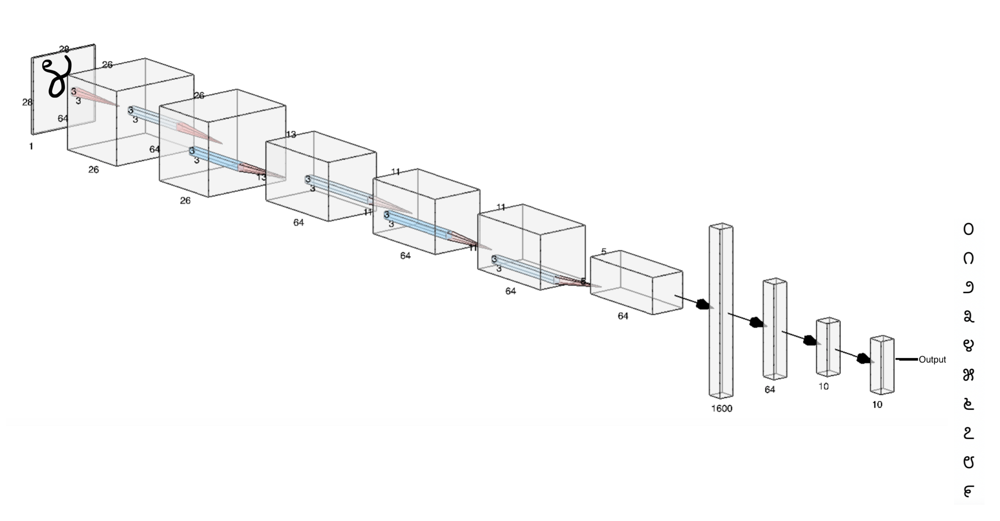

## Kannada Handwritten Digit Recognizer

This project is similar to the MNIST image classification project but with handwritten Kannada numerals. The dataset has been made possible by Vinay Prabhu and can be accessed on [Kaggle](https://www.kaggle.com/c/Kannada-MNIST). This image dataset consists of 70,000 images for the training set and 5000 images for the test set. The model chosen for this multiclass classification is a CNN (convolutional neural network) and the goal is to accurately classify the images into one of ten classes/labels. 

[Image Credit](https://omniglot.com/writing/kannada.htm)

### Project Description 

Handwritten numeral images have proven to be great baseline models for image classification and this project adds to the already rich repertoire of robust image classifiers. The performance of a classifier can be measured using several metrics depending on how the dataset is structured. This dataset is a balanced dataset, meaning, there are equal number of images for all ten labels and hence metrics such as accuracy, precision, recall can be used to measure model performance. 
The image below provides a high level view of how the model classifies an image into one of ten labels. 

### <h3 align="center" id="Multilabel Classification : High Level View of the Model">Multilabel Classification : High Level View of the Model</h3>

[[Image created using NN-SVG](https://alexlenail.me/NN-SVG/)

### Data Preprocessing 

Image preprocessing and data augmentation

### Model Definition 

Layers, optimizer and loss function 

### Model Performance 

Training, validation and test accuracy. 
Model metrics

### GUI : Gradio 

Model performance verification using a realtime, interactive interface to make live predictions. 
Draw the numeral and the model predicts the label with accuracy displayed.(confidence that that label is correct displayed in %) 
