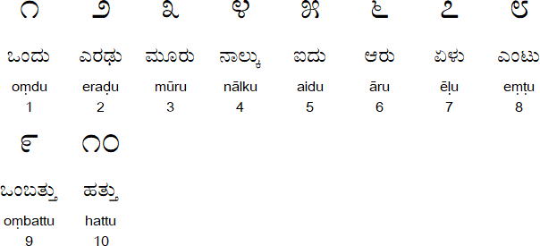
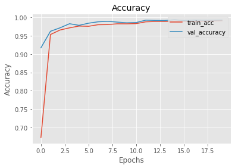
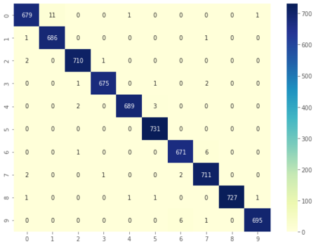

## Kannada Handwritten Digit Recognizer

This project is similar to the MNIST image classification project but with handwritten Kannada numerals. The dataset has been made possible by Vinay Prabhu and can be accessed on [Kaggle](https://www.kaggle.com/c/Kannada-MNIST). This image dataset consists of 70,000 images for the training set and 5000 images for the test set. The model chosen for this multiclass classification is a CNN (convolutional neural network) and the goal is to accurately classify the images into one of ten classes/labels. 

[Image Credit](https://omniglot.com/writing/kannada.htm)

### Project Description 

Handwritten numeral images have proven to be great baseline models for image classification and this project adds to the already rich repertoire of robust image classifiers. The performance of a classifier can be measured using several metrics depending on how the dataset is structured. This dataset is a balanced dataset, meaning, there are equal number of images for all ten labels and hence metrics such as accuracy, precision, recall can be used to measure model performance. 
The image below provides a high level view of how the model classifies an image into one of ten labels. 

#### Multiclass Classification : High Level View of the Model

[Image created using NN-SVG](https://alexlenail.me/NN-SVG/)

### Data Preprocessing 

- For the data processing, the images which are encoded as integers from 0 to 255 are converted to a range between 0 and 1 to maintain homogeneous data. 
- Explicit feature engineering is not required for deep neural networks because the model automatically extracts useful and relevant information from the images for classification.
- The target labels are one-hot encoded and the training and test images are reshaped into a format suitable for the model. 
- To prevent overfitting, images present in the training set can be augmented artificially to generate more images and hence improve the model's generalization capabilities. The images are randomly rotated, zoomed outwards and inwards, vertically and horizontally shaped and feature decorrelation is acheived using the ZCA feature. Since the convolution operation is translation invariant, the model will recognize the features in an image post augmentation. 

### Model Definition 

This CNN model has several layers including Conv2D layers,Dense layers and a Flatten layer. 
The activation function used between the model layers is ReLu and the output layer has a softmax activation function that generates ten different probabilities of the image belonging to a certain label. Dropout is a regularization method that randomly drops several layer connections to prevent overfitting. Model accuracy is monitored throught model training and a callback is defined to monitor the learning rate. If the validation accuracy does not improve after 3 epochs, the leanring rate is halved. 

### Model Performance 

Accuracy is used as the primary metric since the dataset is fairly balanced. Precision and recall are also computed using the classification report. 

- Model Accuracy : The accuracy in both the traning ans validation sets has followed the same trajectory. The model has generalized well and hence this can be used as a reliable metric to measure performance.

- Model Loss

- Confusion Matrix : The confusion matrix displays the model predictions on each label for both the ground truth and model predictions. From the image below, it can be seen that the images of numerals 0 and 1 are usually misclassifed as ech other and the same case hold for digits 6 and 9. 

- Classification Report : This report displays the precision, recall and F1-score for each of the ten labels. For imbalanced datasets, these metrics are of paramount importance. 

### GUI : Gradio 

Model performance verification using a realtime, interactive interface to make live predictions. The Gradio sketchpad takes in hand drawn numerals and diplays the prediction in a sperate window. A numeral is drawn and the model predicts the label with the accuracy displayed.(Confidence that that label is correct is displayed in %). Model complexity and dataset size have prevented deployment to a website. However, local deployment is available.

This project was an inspiration from the hugely popular MNIST dataset for handwritten digit classification.

### Sources 

- 1. Prabhu, V. (2019, August 03). Kannada-MNIST: A new handwritten DIGITS dataset for the Kannada language. Retrieved April 19, 2021, from https://arxiv.org/abs/1908.01242v1
