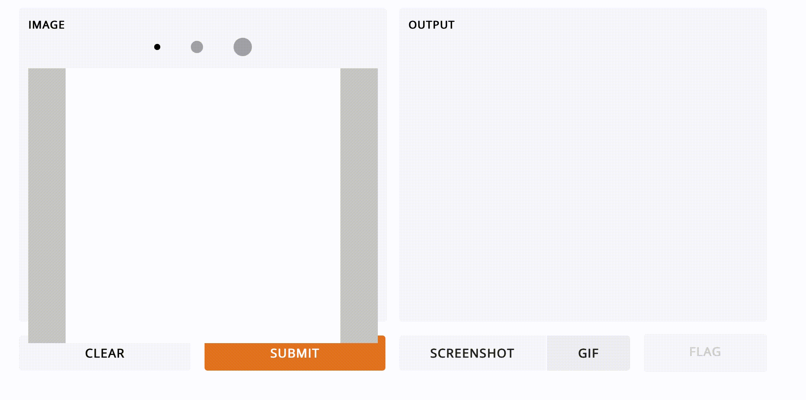

## Kannada Handwritten Digit Recognizer

This project is similar to the MNIST image classification project but with handwritten Kannada numerals, provided by [Vinay Prabhu](https://www.kaggle.com/c/Kannada-MNIST). The dataset consists of around 70,000 images for the training set and 5000 images for the test. The model chosen for this multiclass classification is CNN (convolutional neural networks) and the goal is to accurately classify the images into one of ten labels. 

[Image Credit](https://omniglot.com/writing/kannada.htm)

### Project Description 

Handwritten numeral images have proven to be great baseline models for image classification and this project adds to the already rich repertoire of robust image classifiers. The performance of a classifier can be measured using several metrics depending on how the dataset is structured. This dataset is a balanced dataset, meaning, there are equal number of images for all ten labels and hence metrics such as accuracy, precision, recall can be used to measure model performance. 
The image below provides a high level view of how the model classifies an image into one of ten labels. 

[Image Credit](https://alexlenail.me/NN-SVG/)

Modules used

Data Preprocessing

Model definition

Model training 

### Model Performance 

### GUI : Gradio 
